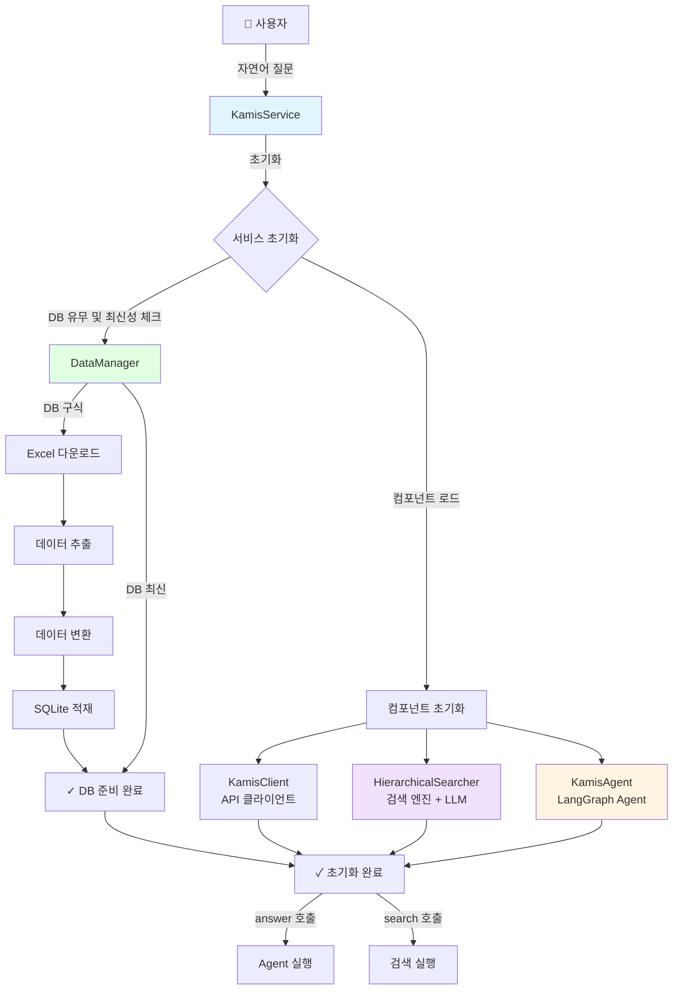
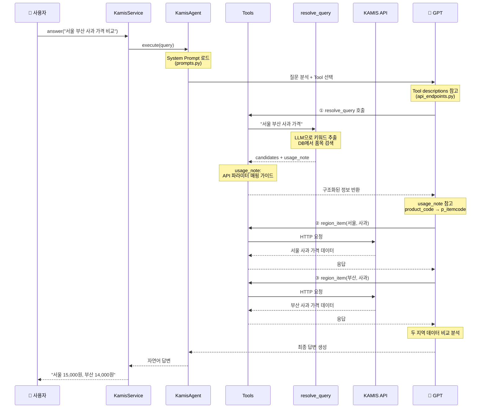
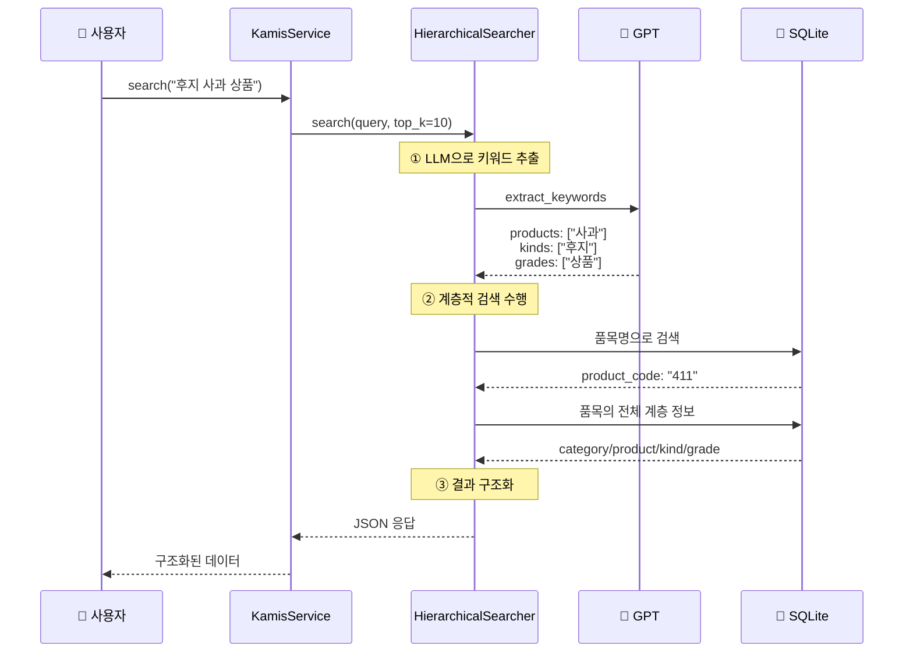
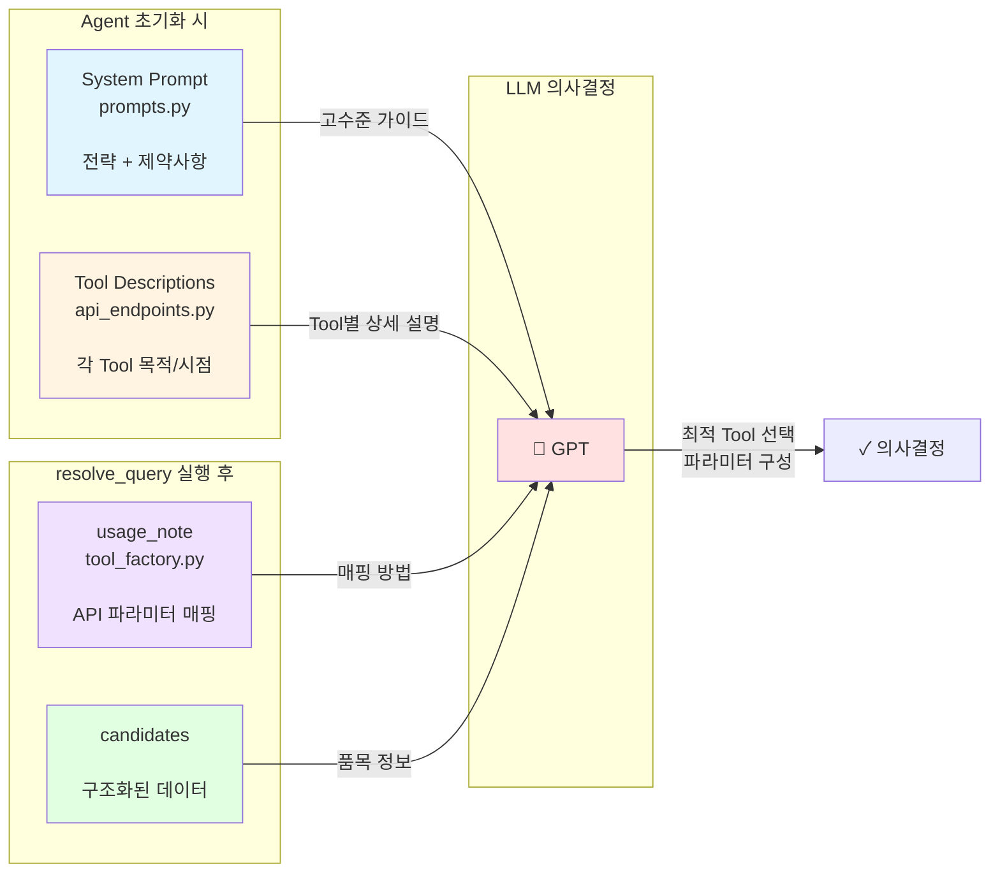

# KAMIS Agent

> 🌾 KAMIS 농축수산물 가격 정보를 LLM Agent로 제공하는 Python 서비스

KAMIS (한국농수산식품유통공사) Open API와 LangGraph를 결합하여, 자연어로 농축수산물 가격 정보를 조회하고 분석할 수 있는 지능형 에이전트입니다.

[](https://www.python.org/downloads/)
[](LICENSE)

## ✨ 주요 기능

- 🤖 **자연어 질의**: 복잡한 API 파라미터 없이 자연어로 질문
- 🔍 **지능형 검색**: LLM이 품목명을 자동으로 매칭
- 📊 **구조화된 데이터**: 다른 Agent가 사용하기 쉬운 JSON 데이터 제공
- 💬 **자연어 답변**: 사용자 친화적인 자연어 답변 생성
- 🔄 **자동 DB 업데이트**: TTL 기반 자동 갱신 (기본 24시간)
- 🛠️ **17개 KAMIS API 통합**: 11개 활성화, 6개 비활성화 (API 오류로 인한)

## 🚀 빠른 시작

### 설치

```bash
pip install -r requirements.txt
```

### 환경 설정

`.env` 파일 생성:

```env
# KAMIS API 인증 (필수)
KAMIS_CERT_KEY=your_cert_key
KAMIS_CERT_ID=your_cert_id

# OpenAI API (필수)
OPENAI_API_KEY=your_openai_key
OPENAI_MODEL=gpt-5-mini

# 선택사항
DB_PATH=kamis_api_list.db
DB_MAX_AGE_HOURS=24
REASONING_EFFORT=minimal
```

### 기본 사용법

```python
from kamis_agent import KamisService

# 서비스 초기화
kamis = KamisService()

# 1️⃣ 구조화된 데이터 조회 (다른 Agent용)
data = kamis.search("오늘 사과 가격")
print(data)
# {
#   "success": true,
#   "query": "사과 가격",
#   "items": [
#     {
#       "category": {"code": "400", "name": "과일류"},
#       "product": {"code": "411", "name": "사과"},
#       ...
#     }
#   ]
# }

# 2️⃣ 자연어 답변 (사용자용)
answer = kamis.answer("오늘 사과 가격은?")
print(answer)
# "2025-10-16 기준 사과(후지) 가격은 10kg당 15,000원입니다."
```

## 🔄 시스템 워크플로우

### 전체 아키텍처



### Agent 실행 플로우 (answer 메서드)



### 검색 플로우 (search 메서드)



### LLM에게 전달되는 정보 구조



## 📂 프로젝트 구조

### 디렉토리 구조

```
kamis_agent/
├── __init__.py              # Public API (search, answer)
├── service.py               # KamisService 메인 클래스
├── exceptions.py            # 예외 클래스
├── config.py                # 환경 설정 관리
│
├── core/
│   ├── __init__.py
│   └── client.py           # KAMIS API HTTP 클라이언트
│
├── search/
│   ├── __init__.py
│   ├── searcher.py         # 계층적 검색 엔진 (LLM 통합)
│   ├── text_processor.py   # 한국어 형태소 분석
│   ├── db_manager.py       # SQLite 연결 관리
│   └── query_builder.py    # SQL 쿼리 생성
│
├── data/
│   ├── __init__.py
│   ├── manager.py          # 데이터 업데이트 관리
│   ├── downloader.py       # KAMIS 문서(Excel) 다운로드
│   ├── extractor.py        # 6개 시트 데이터 추출
│   ├── transformer.py      # 데이터 병합 및 변환
│   └── loader.py           # SQLite DB 적재
│
├── agent/
│   ├── __init__.py
│   ├── executor.py         # LangGraph Agent 실행기
│   ├── tool_factory.py     # LangChain Tool 생성
│   ├── prompts.py          # 시스템 프롬프트
│   └── api_endpoints.py    # 17개 KAMIS API 정의
│
└── tests/
    ├── __init__.py
    └── test_service.py     # 기본 기능 테스트
```

### 핵심 파일 역할 (LLM 정보 제공)

| 파일 | 역할 | 사용 시점 | 제공 정보 |
|------|------|----------|----------|
| **agent/prompts.py** | 전략 가이드 | Agent 초기화 | 작업 프로세스, API 선택 방향성, Critical 제약사항 |
| **agent/api_endpoints.py** | Tool 메타데이터 | Tool 선택 시 | 각 API의 목적, 사용 시점, 파라미터 설명 |
| **agent/tool_factory.py** | 매핑 가이드 | resolve_query 실행 후 | usage_note (API 파라미터 매핑 방법) |

### 정보 조합 예시

**사용자 질문**: "서울과 부산의 사과 가격 비교"

**1단계 - System Prompt (prompts.py)**
```
여러 지역 비교 시 각 지역별로 개별 호출 필요
```

**2단계 - Tool Description (api_endpoints.py)**
```
region_item: "특정 품목의 지역별 가격정보 조회"
```

**3단계 - usage_note (tool_factory.py)**
```
region_codes[i] → p_countrycode (각 지역별 개별 호출)
product_code → p_itemcode
```

**LLM의 의사결정**:
1. "여러 지역 = 개별 호출" 제약 확인
2. region_item Tool 선택 (description 기반)
3. usage_note 참고하여 파라미터 구성
4. 서울 호출 + 부산 호출 → 비교

## 📚 API 문서

### `search(natural_query: str) -> Dict`

자연어 쿼리로 검색하고 구조화된 데이터를 반환합니다.

**용도**: 다른 Agent가 데이터를 가공/분석할 때

```python
# 간단한 질의
data = kamis.search("사과 가격")

# 복잡한 질의
data = kamis.search("지난 3개월 서울과 부산의 배추 가격 비교")

# 반환 형식
{
  "success": true,
  "query": "사과 가격",
  "items": [
    {
      "category": {
        "code": "400",
        "name": "과일류"
      },
      "product": {
        "code": "411",
        "name": "사과"
      },
      "kind": {
        "code": "6",
        "name": "후지"
      },
      "grade": {
        "productrank_code": "4",
        "graderank_code": "1",
        "name": "상품"
      },
      "market": {
        "code": "01",
        "name": "소매"
      }
    }
  ],
  "count": 1
}
```

### `answer(natural_query: str) -> str`

자연어 쿼리로 검색하고 자연어 답변을 생성합니다.

**용도**: 사용자에게 직접 보여줄 답변이 필요할 때

```python
# 간단한 질의
answer = kamis.answer("오늘 사과 가격은?")
# "2025-10-16 기준 사과(후지) 가격은 10kg당 15,000원입니다."

# 복잡한 질의
answer = kamis.answer("최근 한 달간 배추 가격 추이를 설명해줘")
# "최근 한 달간 배추 가격은 상승 추세입니다..."
```

## 🎯 다른 Agent에서 사용 예시

### 식단 계획 Agent

```python
from kamis_agent import KamisService

class MealPlannerAgent:
    """예산 기반 식단 계획 Agent"""
    
    def __init__(self):
        self.kamis = KamisService()
    
    def get_cheap_items(self, budget: int):
        """저렴한 품목 찾기"""
        data = kamis.search("저렴한 채소 5개")
        
        if data.get("success"):
            return self._filter_by_budget(data["items"], budget)
        return []
    
    def show_price_to_user(self, item: str):
        """사용자에게 가격 정보 제공"""
        return self.kamis.answer(f"{item} 가격 알려줘")

# 사용
planner = MealPlannerAgent()
cheap_items = planner.get_cheap_items(budget=50000)
message = planner.show_price_to_user("배추")
```

### 재고 관리 Agent

```python
class InventoryAgent:
    """재고 관리 및 구매 최적화 Agent"""
    
    def __init__(self):
        self.kamis = KamisService()
    
    def check_price_trend(self, item: str, days: int = 30):
        """가격 추이 분석"""
        data = self.kamis.search(f"최근 {days}일 {item} 가격 추이")
        return self._analyze_trend(data)
    
    def compare_regions(self, item: str, regions: list):
        """지역별 가격 비교"""
        query = f"{', '.join(regions)} {item} 가격 비교"
        data = self.kamis.search(query)
        return self._find_cheapest_region(data)
```

## 🧪 테스트

### 테스트 실행

**방법 1: 프로젝트 루트에서 모듈로 실행**
```bash
python -m tests.test_service
```

**방법 2: tests 디렉토리에서 직접 실행**
```bash
cd tests
python test_service.py
```

### 테스트 내용

1. **`search()` 테스트**: 자연어 쿼리로 구조화된 데이터 조회
2. **`answer()` 테스트**: 자연어 쿼리로 답변 생성

### 사전 요구사항

- `.env` 파일에 필수 환경변수 설정
  - `KAMIS_CERT_KEY`, `KAMIS_CERT_ID`, `OPENAI_API_KEY`

## 🔌 지원 KAMIS API 목록

전체 17개 API 중 11개 활성화, 6개 비활성화 (KAMIS API 오류로 인한)

| # | API 명 | 활성화 | 설명 |
|---|--------|:------:|------|
| 1 | daily_by_category | ✅ | 특정일의 부류별 전체 품목 가격 |
| 2 | daily_by_item_period | ❌ | 일별 품목별 가격 (p_startday/endday 미작동) |
| 3 | monthly_sales | ✅ | 월별 가격 (최대 3년) |
| 4 | yearly_sales | ✅ | 연도별 가격 |
| 5 | old_eco_period | ❌ | 친환경 기간별 ('05~'20.3, 파라미터 미작동) |
| 6 | daily_sales_list | ✅ | 최근 거래일 전체 품목 가격 |
| 7 | recent_price_trend | ✅ | 작년/평년 비교 추이 |
| 8 | monthly_price_trend | ❌ | 월평균 추이 (p_regday 미작동) |
| 9 | yearly_price_trend | ❌ | 연평균 추이 (p_regday 미작동) |
| 10 | daily_county | ✅ | 지역별 전체 품목 가격 |
| 11 | old_eco_item | ❌ | 친환경 특정일 ('05~'20.3, 데이터 부족) |
| 12 | new_eco_period | ✅ | 친환경 기간별 ('20.4~) |
| 13 | new_eco_item | ✅ | 친환경 특정일 ('20.4~) |
| 14 | region_item | ✅ | 특정 품목의 지역별 가격 |
| 15 | product_info | ✅ | 전체 품목 코드표 |
| 16 | period_wholesale | ✅ | 도매시장 일별 가격 |
| 17 | period_retail | ✅ | 소매시장 일별 가격 |

**비활성화 사유**: KAMIS API 측의 파라미터 미작동 또는 데이터 부족 문제. 대체 API로 동일 기능 제공.

## 🛠️ 기술 스택

- **Python 3.10+**
- **LangChain / LangGraph**: Agent 프레임워크
- **OpenAI API (GPT-5-mini)**: LLM
- **SQLite**: 품목 데이터베이스
- **Kiwipiepy**: 한국어 형태소 분석
- **Pandas**: 데이터 처리

## 🔒 환경 변수

| 변수 | 필수 | 기본값 | 설명 |
|-----|------|--------|------|
| `KAMIS_CERT_KEY` | ✅ | - | KAMIS API 인증키 |
| `KAMIS_CERT_ID` | ✅ | - | KAMIS API 인증ID |
| `OPENAI_API_KEY` | ✅ | - | OpenAI API 키 |
| `OPENAI_MODEL` | ❌ | gpt-5-mini | 사용할 모델 |
| `REASONING_EFFORT` | ❌ | minimal | 추론 정도 |
| `DB_PATH` | ❌ | kamis_api_list.db | DB 파일 경로 |
| `DB_MAX_AGE_HOURS` | ❌ | 24 | DB 최대 유효 시간 |

### KAMIS API 인증키 발급

1. [KAMIS 오픈 API](https://www.kamis.or.kr/customer/reference/openapi_list.do) 접속
2. 회원가입 및 로그인
3. API 신청
4. 발급된 인증키를 `.env`에 설정

## ⚠️ 알려진 이슈

### KAMIS API 오류로 인한 비활성화 (6개)

일부 KAMIS API에서 파라미터가 정상적으로 작동하지 않는 문제로 인해 비활성화되었습니다:

<details>
<summary><b>#2 일별 품목별 도·소매가격정보</b></summary>

- **문제**: `p_startday`, `p_endday` 파라미터 미작동
- **대체**: `period_wholesale` (도매) + `period_retail` (소매)
</details>

<details>
<summary><b>#5 친환경농산물 가격정보('05~'20.3.)</b></summary>

- **문제**: `p_startday`, `p_endday` 파라미터 미작동
- **대체**: `new_eco_period` (2020.4 이후만 제공)
</details>

<details>
<summary><b>#8 월평균 가격추이</b></summary>

- **문제**: `p_regday` 파라미터 미작동
- **대체**: `monthly_sales` 데이터를 LLM이 분석
</details>

<details>
<summary><b>#9 연평균 가격추이</b></summary>

- **문제**: `p_regday` 파라미터 미작동
- **대체**: `yearly_sales` 데이터를 LLM이 분석
</details>

<details>
<summary><b>#11 친환경농산물 품목별('05~'20.3.)</b></summary>

- **문제**: 대부분 날짜에 데이터 없음
- **대체**: `new_eco_item` (2020.4 이후만 제공)
</details>

**참고**: 비활성화된 API는 `agent/api_endpoints.py`에 주석으로 보존되어 있으며, KAMIS API 수정 시 재활성화 가능합니다.

## 📄 라이선스

MIT License - 자세한 내용은 [LICENSE](LICENSE) 파일을 참조하세요.